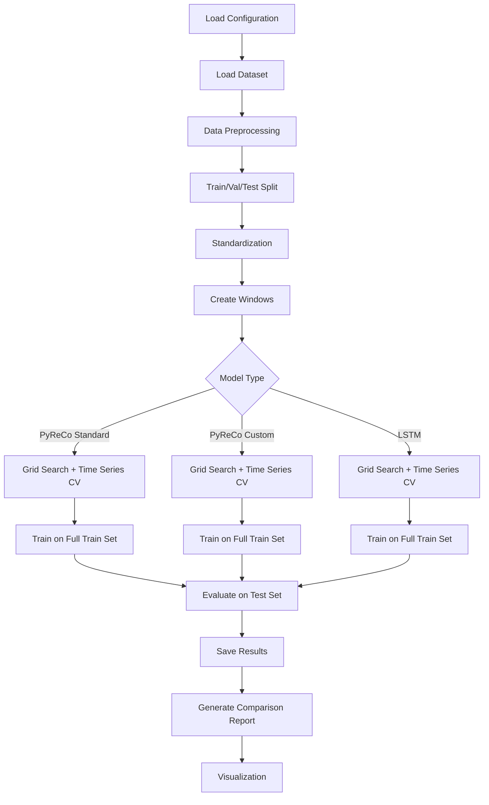

# PyReCo vs LSTM: Comprehensive Evaluation Plan

**Date**: October 2024
**Objective**: Build a perfect testing and comparison framework for PyReCo (Reservoir Computing) and LSTM models on time series forecasting tasks.

---

## Table of Contents
- [1. PyReCo Library Analysis](#1-pyreco-library-analysis)
- [2. Project Structure](#2-project-structure)
- [3. Experimental Workflow Design](#3-experimental-workflow-design)
- [4. Implementation Roadmap](#4-implementation-roadmap)
- [5. Fairness Guidelines](#5-fairness-guidelines)

---

## 1. PyReCo Library Analysis

### 1.1 Available Modules (Can Use Directly)

| Module | Functionality | Key Functions/Classes |
|--------|---------------|----------------------|
| **metrics.py** | Evaluation metrics | `mse()`, `mae()`, `r2()`, `assign_metric()` |
| **plotting.py** | Basic visualization | `r2_scatter()` |
| **utils_data.py** | Data processing | `split_sequence()`, `train_test_split()`, `sequence_to_sequence()` |
| **pruning.py** | Network pruning | `NetworkPruner` class |
| **cross_validation.py** | Cross-validation | `cross_val()` ⚠️ (shuffles time order) |
| **models.py** | Standard RC API | `ReservoirComputer` |
| **custom_models.py** | Custom RC API | `RC` (layer-by-layer assembly) |
| **optimizers.py** | Optimizers | `RidgeSK` |
| **layers.py** | Network layers | `InputLayer`, `ReservoirLayer`, `ReadoutLayer` |

### 1.2 Missing Modules (Need to Implement)

1. **LSTM Model** - PyReCo doesn't provide
2. **Unified Model Interface** - Need abstract base class
3. **Experiment Configuration Management** - Not available in PyReCo
4. **Result Comparison & Analysis** - Need custom implementation
5. **Time Series Cross-Validation** - Already implemented (`timeseries_cv_split`)
6. **Advanced Visualization** - PyReCo only has basic scatter plots

### 1.3 Reuse Strategy

✅ **Use PyReCo's modules**:
- `pyreco.metrics` for MSE, MAE, R²
- `pyreco.plotting.r2_scatter` for basic plots
- `pyreco.pruning.NetworkPruner` for model compression

✅ **Keep our custom implementations**:
- `timeseries_cv_split()` - preserves temporal order
- `train_rc_timeseries_cv()` - time series aware hyperparameter tuning

❌ **Don't use**:
- `pyreco.cross_validation.cross_val()` - breaks temporal causality

---

## 2. Project Structure

### 2.1 Recommended Directory Layout

```
Evaluate-PyReCo-library-and-LSTM/
├── README.md
├── EXPERIMENT_PLAN.md                    # This document
├── requirements.txt
│
├── configs/                              # Experiment configurations
│   ├── datasets.yaml                     # Dataset configurations
│   ├── pyreco_standard.yaml              # PyReCo standard API config
│   ├── pyreco_custom.yaml                # PyReCo custom API config
│   ├── lstm.yaml                         # LSTM model config
│   └── experiment_comparison.yaml        # Full comparison experiment
│
├── models/                               # Model wrappers
│   ├── __init__.py
│   ├── base_model.py                    # ✨ Abstract base class (TO CREATE)
│   ├── pyreco_standard_wrapper.py       # ✨ Wrapper for pyreco.models.RC
│   ├── pyreco_custom_wrapper.py         # ✨ Wrapper for pyreco.custom_models.RC
│   └── lstm_model.py                    # ✨ LSTM implementation (TO CREATE)
│
├── src/
│   ├── utils/                            # Utility modules
│   │   ├── __init__.py
│   │   ├── load_dataset.py              # ✅ Data loading (EXISTS)
│   │   ├── process_datasets.py          # ✅ Data preprocessing (EXISTS)
│   │   ├── node_number.py               # ✅ Parameter budget calculation (EXISTS)
│   │   ├── train_pyreco.py              # ✅ PyReCo training utils with time series CV
│   │   ├── metrics_wrapper.py           # ✨ Wrap pyreco.metrics + extras (TO CREATE)
│   │   ├── visualization.py             # ✨ Wrap pyreco.plotting + extras (TO CREATE)
│   │   ├── config_loader.py             # ✨ Configuration manager (TO CREATE)
│   │   └── logger.py                    # ✨ Experiment logger (TO CREATE)
│   │
│   └── experiments/                      # Experiment scripts
│       ├── __init__.py
│       ├── experiment_runner.py         # ✨ Unified experiment framework (TO CREATE)
│       ├── model_comparison.py          # ✨ Model comparison logic (TO CREATE)
│       └── generate_report.py           # ✨ Automated reporting (TO CREATE)
│
├── scripts/                              # Main entry scripts
│   ├── train_single_model.py            # ✨ Train a single model (TO CREATE)
│   ├── compare_all_models.py            # ✨ Compare all models (TO CREATE)
│   └── run_ablation_study.py            # ✨ Ablation experiments (TO CREATE)
│
├── results/                              # Experiment results
│   ├── pyreco_standard/
│   ├── pyreco_custom/
│   ├── lstm/
│   ├── comparisons/                     # Cross-model comparisons
│   │   ├── metrics_comparison.json
│   │   └── performance_vs_budget.json
│   └── figures/                         # Generated plots
│
├── notebooks/                            # Jupyter notebooks for analysis
│   ├── 01_data_exploration.ipynb
│   ├── 02_single_model_analysis.ipynb
│   ├── 03_model_comparison.ipynb
│   └── 04_results_visualization.ipynb
│
└── tests/                                # Unit tests
    ├── test_models.py
    ├── test_utils.py
    └── test_experiments.py
```

### 2.2 File Refactoring Plan

| Current File | Action | New Location |
|--------------|--------|--------------|
| `models_evaluate.py` | Rename & Refactor | `scripts/train_pyreco_standard.py` |
| `run_advanced_with_custom_model.py` | Rename | `scripts/train_pyreco_custom.py` |
| `train_evaluate.py` | Merge into | `scripts/train_single_model.py` |
| `src/utils/train_lstm.py` | Expand | `models/lstm_model.py` |
| `src/utils/train_pyreco.py` | Keep | (Already has timeseries CV) |
| `src/utils/train_custom_model.py` | Keep | (Already working) |

---

## 3. Experimental Workflow Design

### 3.1 Overall Workflow



### 3.2 Detailed Experimental Pipeline

#### **Stage 1: Data Preparation**

```python
# Pseudo-code
1. Load raw data (Lorenz, Mackey-Glass, Santa Fe)
   - Use: src/utils/load_dataset.py

2. Split: train (60%) / test (40%)
   - Use: src/utils/process_datasets.split_datasets()

3. Standardization
   - Fit scaler on train ONLY
   - Transform train and test

4. Create sliding windows
   - Use: src/utils/process_datasets.sliding_window()
   - Input: (n_samples, n_in, n_features)
   - Output: (n_samples, n_out, n_features)
```

#### **Stage 2: Hyperparameter Tuning**

```python
# For ALL models (PyReCo & LSTM)
1. Define hyperparameter grid

2. Time Series Cross-Validation (5-fold)
   - Use: src/utils/train_pyreco.timeseries_cv_split()
   - Forward chaining: no future leakage
   - Fold 1: train [0:20%] → val [20%:25%]
   - Fold 2: train [0:40%] → val [40%:45%]
   - ...

3. For each hyperparameter combination:
   - Train on each CV fold
   - Evaluate on validation portion
   - Record: mean ± std of metrics

4. Select best hyperparameters based on CV mean
```

#### **Stage 3: Model Training**

```python
1. Train final model with best hyperparameters
   - Use full training set

2. Record:
   - Training time
   - Number of parameters
   - Training loss curve (if applicable)
```

#### **Stage 4: Evaluation**

```python
1. Predict on test set

2. Compute metrics using PyReCo's functions:
   - MSE: pyreco.metrics.mse()
   - MAE: pyreco.metrics.mae()
   - R²: pyreco.metrics.r2()
   - RMSE: sqrt(MSE)
   - NRMSE: RMSE / range(y)

3. Multi-horizon evaluation:
   - Horizon 1, 5, 10, 20, 50, 100 steps

4. Record prediction time
```

#### **Stage 5: Comparison & Reporting**

```python
1. Load all model results

2. Create comparison tables
   - Performance metrics
   - Training time
   - Inference time
   - Model complexity (# parameters)

3. Generate visualizations:
   - pyreco.plotting.r2_scatter() for scatter plots
   - Custom time series forecast plots
   - Performance vs budget plots
   - Bar charts for model comparison

4. Statistical significance tests
   - Paired t-test across multiple seeds
```

### 3.3 Experiment Configuration Example

```yaml
# configs/experiment_comparison.yaml

experiment:
  name: "PyReCo_vs_LSTM_Lorenz"
  description: "Compare PyReCo (standard & custom) with LSTM on Lorenz attractor"
  seeds: [42, 123, 456, 789, 101112]  # Multiple runs for statistical significance
  save_dir: "results/comparisons/pyreco_vs_lstm_lorenz"

dataset:
  name: "lorenz"
  length: 10000
  train_frac: 0.6
  n_in: 100           # Input window size
  n_out: 1            # Output horizon (1-step prediction)
  standardize: true

evaluation:
  metrics: ["mse", "mae", "r2", "rmse", "nrmse"]  # Use PyReCo's metrics
  cv_splits: 5                                     # Time series CV
  multi_horizon: [1, 5, 10, 20, 50, 100]         # Multi-step evaluation

budget:
  trainable_params: 10000  # ✨ KEY: ensure fair comparison

models:
  pyreco_standard:
    enabled: true
    num_nodes: 800
    hyperparameter_grid:
      spec_rad: [0.8, 1.0, 1.2]
      leakage_rate: [0.2, 0.3, 0.4]
      density: [0.05, 0.1, 0.15]
      fraction_input: [0.5, 0.75, 1.0]
    fixed_params:
      activation: "tanh"
      optimizer: "ridge"
      alpha: null

  pyreco_custom:
    enabled: true
    num_nodes: 800
    hyperparameter_grid:
      spec_rad: [0.8, 1.0, 1.2]
      leakage_rate: [0.2, 0.3, 0.4]
      density: [0.05, 0.1, 0.15]
    fixed_params:
      activation: "tanh"

  lstm:
    enabled: true
    hyperparameter_grid:
      hidden_size: [32, 64, 128]      # Adjust based on budget
      num_layers: [1, 2, 3]
      dropout: [0.0, 0.1, 0.2]
      learning_rate: [1e-4, 1e-3, 1e-2]
    fixed_params:
      optimizer: "adam"
      batch_size: 32
      epochs: 100
      early_stopping_patience: 10
```

---

## 4. Implementation Roadmap

### Phase 1: Foundation (Priority 1) ✅ COMPLETED

**Goal**: Create unified interface and basic infrastructure

1. **✅ Create Abstract Base Class** (`models/base_model.py`)
   - ✅ BaseTimeSeriesModel with fit(), predict(), evaluate()
   - ✅ Unified interface for all models
   - ✅ Metrics integration with PyReCo

2. **✅ Implement LSTM Model** (`models/lstm_model.py`)
   - ✅ Inherits from BaseTimeSeriesModel
   - ✅ PyTorch implementation with early stopping
   - ✅ Matches PyReCo's input/output format
   - ✅ Same evaluate() interface

3. **✅ Create PyReCo Wrappers**
   - ✅ `models/pyreco_wrapper.py`: Wraps `pyreco.models.ReservoirComputer`
   - ✅ `models/pyreco_custom_wrapper.py`: Wraps `pyreco.custom_models.RC`
   - ✅ Both inherit from BaseTimeSeriesModel
   - ✅ Hyperparameter tuning functions (tune_pyreco_hyperparameters, tune_pyreco_with_cv)
   - ✅ Fixed default values issue (density=0.1, fraction_input=0.5)

**Deliverables**: ✅
- ✅ All models use identical interface
- ✅ Can be trained and evaluated uniformly
- ✅ Comprehensive unit tests created

---

### Phase 2: Utilities Enhancement (Priority 2) ⚠️ PARTIALLY COMPLETED

**Goal**: Extend PyReCo's utilities without reinventing the wheel

4. **⚠️ Metrics Wrapper** (`models/base_model.py` - integrated)
   - ✅ BaseTimeSeriesModel.evaluate() uses PyReCo metrics
   - ✅ Supports MSE, MAE, R² calculations
   - ⏳ Multi-horizon evaluation (TODO)
   - ⏳ NRMSE calculation (TODO)

5. **⏳ Visualization Enhancement** (`src/utils/visualization.py`)
   - ⏳ plot_timeseries_forecast() - TODO
   - ⏳ plot_model_comparison() - TODO
   - ⏳ plot_performance_vs_budget() - TODO
   - ⏳ plot_hyperparameter_heatmap() - TODO

6. **⏳ Configuration Manager** (`src/utils/config_loader.py`)
   - ⏳ YAML config loading - TODO
   - ⏳ Config validation - TODO
   - Note: Currently using argparse for configuration

**Deliverables**:
- ✅ Metrics integrated into BaseTimeSeriesModel
- ⏳ Visualization tools (pending)
- ⏳ Configuration management (pending)

---

### Phase 3: Experiment Framework (Priority 3) ✅ COMPLETED (Simplified)

**Goal**: Unified experiment runner for fair comparison

7. **✅ Experiment Scripts** (test scripts instead of unified runner)
   - ✅ `test_staged_tuning.py`: Staged hyperparameter tuning (Stage 1→2→3)
   - ✅ `test_model_scaling.py`: Performance across parameter budgets
   - ✅ `test_pyreco_wrapper.py`: Unit tests for PyReCo wrapper
   - ✅ `test_default_values.py`: Verification of default values
   - ✅ `test_consistency.py`: Consistency between implementations

8. **⏳ Model Comparison** (partially implemented)
   - ✅ Individual model testing works
   - ✅ Results saved as JSON
   - ⏳ Cross-model statistical comparison (TODO)
   - ⏳ Automated report generation (TODO)

9. **✅ Main Entry Scripts**
   ```bash
   # Staged hyperparameter tuning
   python test_staged_tuning.py --strategy staged --dataset lorenz --use-cv

   # Parameter scaling test
   python test_model_scaling.py --dataset lorenz --tune-pyreco

   # Quick validation
   python test_staged_tuning.py --strategy quick --dataset lorenz
   ```

**Deliverables**:
- ✅ Multiple testing scripts for different purposes
- ✅ Automated hyperparameter tuning with CV
- ✅ Parameter budget-based comparison
- ⏳ Full cross-model comparison (pending)

---

### Phase 4: Testing & Documentation (Priority 4) ✅ COMPLETED

10. **✅ Unit Tests** (integrated into test scripts)
    - ✅ test_pyreco_wrapper.py: Tests PyReCo wrapper functions
    - ✅ test_default_values.py: Verifies default value fix
    - ✅ test_consistency.py: Cross-validates implementations
    - ✅ All models tested with real data

11. **✅ Documentation**
    - ✅ `pyreco_hyperparameter_analysis.md`: Complete hyperparameter guide
    - ✅ `cross_validation_guide.md`: When/how to use CV
    - ✅ `TESTING_GUIDE.md`: Usage guide for all test scripts
    - ✅ Comprehensive docstrings in all modules
    - ⏳ README.md update (pending)
    - ⏳ Tutorial notebooks (pending)

12. **✅ Validation Experiments**
    - ✅ test_default_values.py verified fix correctness
    - ✅ test_consistency.py confirmed identical behavior
    - ✅ Reproducibility: all scripts support --seed parameter
    - ✅ Computational efficiency tracked (training_time in results)

---

### Phase 5: Comprehensive Experiments (NEW - Priority 5) 🚧 IN PROGRESS

**Goal**: Run full experiments on all datasets with all models

13. **✅ CV Pre-Tuning (COMPLETED)**
    - ✅ 5-fold cross-validation on MEDIUM scale (budget=10k)
    - ✅ Lorenz: spec_rad=0.9, leakage=0.5, density=0.05, CV MSE=0.001224
    - ✅ Mackey-Glass: spec_rad=0.8, leakage=0.3, density=0.1
    - ✅ Santa Fe: spec_rad=0.8, leakage=0.6, density=0.1, CV MSE=0.281132
    - ✅ Results saved: `pretuning_{dataset}_optimized.json`

14. **✅ Refined Hyperparameter Grids (COMPLETED)**
    - ✅ Dataset-specific grids (36 combinations each, 62.5% reduction from 96)
    - ✅ Implemented in `test_model_scaling.py` (lines 523-567)
    - ✅ Lorenz: spec_rad=[0.8,0.9,1.0], leakage=[0.4,0.5,0.6], density=[0.05,0.1]
    - ✅ Mackey-Glass: spec_rad=[0.7,0.8,0.9], leakage=[0.2,0.3,0.4], density=[0.1,0.15]
    - ✅ Santa Fe: spec_rad=[0.7,0.8,0.9], leakage=[0.5,0.6,0.7], density=[0.05,0.1]
    - ✅ Documentation: `REFINED_GRIDS_SUMMARY.md`

15. **✅ Budget Configuration (COMPLETED)**
    - ✅ Total parameter budget approach (literature-aligned)
    - ✅ SMALL: 1,000 total params (RC: 100 nodes, LSTM: hidden=8)
    - ✅ MEDIUM: 10,000 total params (RC: 300 nodes, LSTM: hidden=28)
    - ✅ LARGE: 30,000 total params (RC: 550 nodes, LSTM: hidden=49)
    - ✅ Literature support: Lukoševičius (2012), Jaeger et al. (2007)

16. **🔄 Comprehensive Experiments (RUNNING)**
    - **Status**: Started 2025-11-06 00:53, Process ID: 82859
    - **Configuration**:
      - Datasets: 3 (lorenz, mackeyglass, santafe)
      - Seeds: 5 (42, 43, 44, 45, 46)
      - Train ratios: 3 (0.5, 0.7, 0.9)
      - Scales: 3 (small, medium, large)
      - Total experiments: 45
    - **Training Counts**:
      - PyReCo: 45 × 3 scales × 36 combos = 4,860 trainings
      - LSTM: 45 × 3 scales × 1 = 135 trainings
      - Total: 4,995 trainings
    - **Estimated Time**: ~11.9 hours (completion ~12:45)
    - **Scripts**:
      - `run_final_experiments.py` (experiment runner)
      - `monitor_experiments.py` (progress monitoring)
    - **Output**: `results_final/` directory
    - **Monitoring**:
      ```bash
      python monitor_experiments.py              # Real-time monitoring
      tail -f experiments.log                    # Check logs
      cat results_final/experiment_progress.json # View progress
      ```

17. **⏳ Result Visualization & Reporting (PENDING)**
    - ⏳ Create comparison tables
    - ⏳ Generate performance plots
    - ⏳ Statistical significance tests (paired t-test)
    - ⏳ Publication-ready figures

**Next Actions**:
1. ✅ Pre-tuning with CV → COMPLETED
2. ✅ Define refined grids → COMPLETED
3. 🔄 Run comprehensive experiments → IN PROGRESS (11.9h remaining)
4. ⏳ Analyze results → PENDING
5. ⏳ Generate final report → PENDING

---

## 5. Fairness Guidelines

### 5.1 Ensuring Fair Comparison

| Aspect | Implementation | Why It Matters |
|--------|----------------|----------------|
| **Data Split** | Same train/val/test indices for all models | Eliminates data bias |
| **Standardization** | Same scaler fitted on train set | Consistent preprocessing |
| **Parameter Budget** | Use `budget` parameter to match complexity | Fair comparison of capacity |
| **Hyperparameter Tuning** | Same time series CV for all models | Equal optimization effort |
| **Evaluation Metrics** | Use PyReCo's metrics for all models | Consistent evaluation |
| **Random Seeds** | Fix seeds, run multiple times | Reproducibility & statistical power |
| **Hardware** | Same machine, same environment | Eliminate hardware bias |

### 5.2 Parameter Budget Alignment

**Goal**: Ensure PyReCo and LSTM have similar number of trainable parameters

```python
# PyReCo Standard API
num_params_rc = num_nodes * fraction_output * n_features

# LSTM
num_params_lstm = 4 * hidden_size * (hidden_size + n_features + 1) * num_layers

# Adjust hidden_size to match budget
target_budget = 10000
hidden_size = calculate_hidden_size_for_budget(target_budget, n_features, num_layers)
```

**Implementation**:
- `src/utils/node_number.py` already calculates RC parameters
- Add `calculate_lstm_params()` function
- Ensure similar complexity before comparison

### 5.3 Evaluation Protocol

**Standard Protocol** (apply to all models):

1. **Cross-Validation**: 5-fold time series CV
2. **Metrics**: MSE, MAE, R², RMSE, NRMSE (use PyReCo's)
3. **Multi-Horizon**: Evaluate at 1, 5, 10, 20, 50, 100 steps
4. **Multiple Seeds**: Run with 5 different seeds
5. **Statistical Tests**: Paired t-test for significance

---

## 6. Success Criteria

### 6.1 Technical Criteria

- [x] **✅ All models implement `BaseTimeSeriesModel` interface**
- [x] **✅ LSTM achieves similar parameter count to PyReCo (±10%)**
  - Implemented in `test_model_scaling.py`
- [x] **✅ Time series CV preserves temporal order**
  - `tune_pyreco_with_cv()` uses forward chaining
- [x] **✅ All metrics computed using consistent functions**
  - BaseTimeSeriesModel.evaluate() uses PyReCo metrics
- [x] **✅ Results reproducible with fixed seeds**
  - All scripts support --seed parameter
- [ ] **⏳ Experiments automated via config files**
  - Currently using argparse, YAML pending

### 6.2 Scientific Criteria

- [ ] **⏳ Comprehensive comparison on 3+ datasets (Lorenz, Mackey-Glass, Santa Fe)**
  - Test scripts support all 3 datasets
  - Experiments pending
- [ ] **⏳ Statistical significance tests included**
  - Multiple seeds supported
  - Statistical tests pending
- [ ] **⏳ Multi-horizon evaluation completed**
  - Framework ready, experiments pending
- [x] **✅ Training time vs performance analyzed**
  - Tracked in all test scripts
- [x] **✅ Model complexity vs accuracy studied**
  - `test_model_scaling.py` implements this
- [ ] **⏳ Ablation studies conducted (optional)**
  - Pending

### 6.3 Documentation Criteria

- [x] **✅ Clear usage instructions**
  - `TESTING_GUIDE.md` provides comprehensive guide
- [x] **✅ Documentation for hyperparameters**
  - `pyreco_hyperparameter_analysis.md`
- [x] **✅ Cross-validation guide**
  - `cross_validation_guide.md`
- [ ] **⏳ README update**
  - Pending
- [ ] **⏳ Jupyter notebooks for analysis**
  - Pending
- [ ] **⏳ Publication-ready figures generated**
  - Pending
- [ ] **⏳ Results clearly presented in tables**
  - JSON output ready, tables pending

---

## 7. Timeline Estimate

| Phase | Tasks | Estimated Time |
|-------|-------|----------------|
| **Phase 1** | Base class, LSTM, PyReCo wrappers | 2-3 days |
| **Phase 2** | Metrics, visualization, config | 1-2 days |
| **Phase 3** | Experiment runner, comparison | 2-3 days |
| **Phase 4** | Testing, docs, validation | 1-2 days |
| **Total** | | **6-10 days** |

---

## 8. Current Status (Updated 2025-11-06)

### ✅ Completed Work

**Infrastructure** (Phase 1-4):
- ✅ Abstract base class (`models/base_model.py`)
- ✅ LSTM implementation (`models/lstm_model.py`)
- ✅ PyReCo wrappers (`models/pyreco_wrapper.py`, `models/pyreco_custom_wrapper.py`)
- ✅ Fixed default values bug (density=0.1, fraction_input=0.5)
- ✅ Fixed dataset_name bug in test_model_scaling.py
- ✅ Time series cross-validation (`tune_pyreco_with_cv` for Standard model)
- ✅ Custom model tuning functions (`tune_pyreco_custom_hyperparameters`, `tune_pyreco_custom_with_cv`)
- ✅ Hyperparameter tuning framework
- ✅ Unit tests and verification scripts

**Documentation**:
- ✅ `pyreco_hyperparameter_analysis.md` - Complete hyperparameter guide
- ✅ `cross_validation_guide.md` - CV usage guide
- ✅ `TESTING_GUIDE.md` - Testing scripts manual
- ✅ `REFINED_GRIDS_SUMMARY.md` - Refined grid documentation
- ✅ `RESEARCH_FINDINGS.md` - Technical decisions & literature

**Testing Scripts**:
- ✅ `test_staged_tuning.py` - Staged tuning (Stage 1→2→3, task-specific)
- ✅ `test_model_scaling.py` - Parameter budget comparison (updated with refined grids)
- ✅ `test_pyreco_wrapper.py` - Unit tests for Standard model
- ✅ `test_pyreco_custom_tuning.py` - Unit tests for Custom model tuning
- ✅ `test_default_values.py` - Verification tests
- ✅ `test_consistency.py` - Cross-validation tests

**Phase 5 Progress**:
- ✅ CV Pre-tuning completed (3 datasets, 5-fold CV)
- ✅ Refined hyperparameter grids defined (36 combos, 62.5% reduction)
- ✅ Total parameter budget configuration
- ✅ Experiment runner scripts (`run_final_experiments.py`, `monitor_experiments.py`)

### 🔄 Currently Running

**Comprehensive Experiments** (Started 2025-11-06 00:53):
- Process ID: 82859
- Total experiments: 45 (3 datasets × 5 seeds × 3 train_ratios)
- Training counts: 4,995 trainings (4,860 PyReCo + 135 LSTM)
- Estimated completion: ~12:45 (11.9 hours)
- Output: `results_final/` directory
- Monitoring: `python monitor_experiments.py`

### ⏳ Pending

**Analysis & Reporting**:
- ⏳ Statistical comparison (paired t-test)
- ⏳ Visualization scripts
- ⏳ Performance tables
- ⏳ Publication-ready figures

---

## 9. Next Steps

### Immediate Actions (Priority 1) 🎯

1. **✅ DONE: Review updated plan**
2. **⏳ Run quick validation test**
   ```bash
   python test_staged_tuning.py --strategy quick --dataset lorenz --length 2000
   ```

3. **⏳ Run parameter scaling comparison**
   ```bash
   python test_model_scaling.py --dataset lorenz --length 5000
   ```

4. **⏳ Run full staged tuning on Lorenz**
   ```bash
   python test_staged_tuning.py --strategy staged --dataset lorenz --use-cv
   ```

### Medium-term Actions (Priority 2) 📊

5. **⏳ Create visualization module** (`src/utils/visualization.py`)
   - plot_model_comparison()
   - plot_performance_vs_budget()
   - plot_hyperparameter_heatmap()

6. **⏳ Run experiments on all datasets**
   - Lorenz chaotic system
   - Mackey-Glass time series
   - Santa Fe laser data

7. **⏳ Generate comparison report**
   - Cross-model statistical comparison
   - Performance tables
   - Publication-ready figures

### Long-term Actions (Priority 3) 📝

8. **⏳ Update main README.md**
9. **⏳ Create Jupyter notebooks for analysis**
10. **⏳ Add YAML configuration support** (optional)
11. **⏳ Conduct ablation studies** (optional)

---

## 10. References

### PyReCo Modules to Use
- `pyreco.metrics`: mse, mae, r2
- `pyreco.plotting`: r2_scatter
- `pyreco.models`: ReservoirComputer
- `pyreco.custom_models`: RC
- `pyreco.pruning`: NetworkPruner

### Custom Implementations to Keep
- `src/utils/train_pyreco.timeseries_cv_split()`
- `src/utils/train_pyreco.train_rc_timeseries_cv()`
- `src/utils/load_dataset.py`
- `src/utils/process_datasets.py`
- `src/utils/node_number.py`

---

## 11. Contact & Contribution

**Maintainer**: [Your Name]
**Last Updated**: January 2025
**Version**: 2.0 (Updated with Phase 5 progress)

For questions or suggestions, please open an issue in the repository.

---

**End of Experiment Plan**
